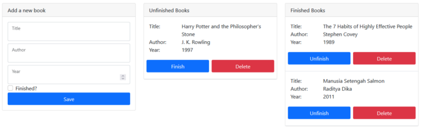

# Bookshelf App
The app that helps you track the books you have and haven't finished.

The front-end is built with React and React-Bootstrap, while the back-end is built with
Django Rest Framework.

This mono-repository is developed along with the tutorial series I wrote
"How to Build a Bookshelf App with Django and React".

[Part 1: Django - How to Build a Bookshelf App with Django and React](https://python.plainenglish.io/how-to-build-a-bookshelf-app-with-django-and-react-part-1-e020b0f28e6b)

[Part 2: React - How to Build a Bookshelf App with Django and React](https://python.plainenglish.io/how-to-build-a-bookshelf-app-with-django-and-react-f509ce92adba)
